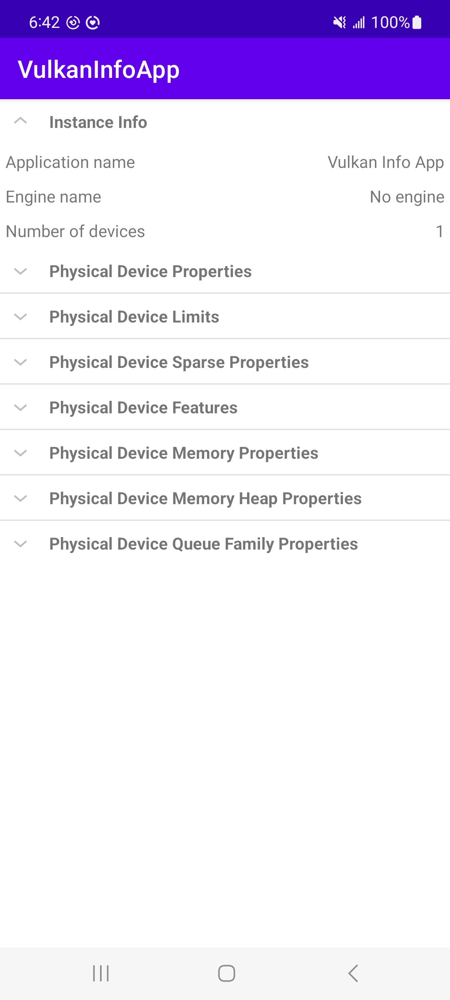
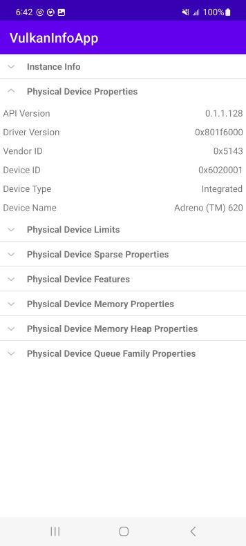
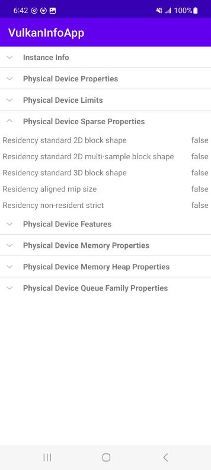

# VkInfoApp
Android app that displays info about a Vulkan instance and the GPU.

## Overview
This app creates a Vulkan instance on the device, gathers info related to the instance and the selected GPU using the info provided by Vulkan, then displays the info to the user in an ExpandableListAdapter that allows the user to expand or collapse categories.

The JNI bridge code contained in JniBridge.cpp is used to make the C++ calls to the Vulkan API. The native C++ methods populate Java classes with Vulkan info, which is then presented to the screen in MainActivity.java.

I will continue to update the screenshots as development continues.

## Development Environment
Android Studio 2022.2.1
Java Native Activity

## Sample Screenshots
Screenshots were captured on a Samsung Galaxy A71 5G. Model name: SM-A716U

General info about the instance that was created:

The info contained in VkPhysicalDeviceProperties:

Some of the VkPhysicalDeviceLimits:

 the VkPhysicalDeviceProperties.VkPhysicalDeviceLimits")

The VkPhysicalDeviceSparseProperties:

